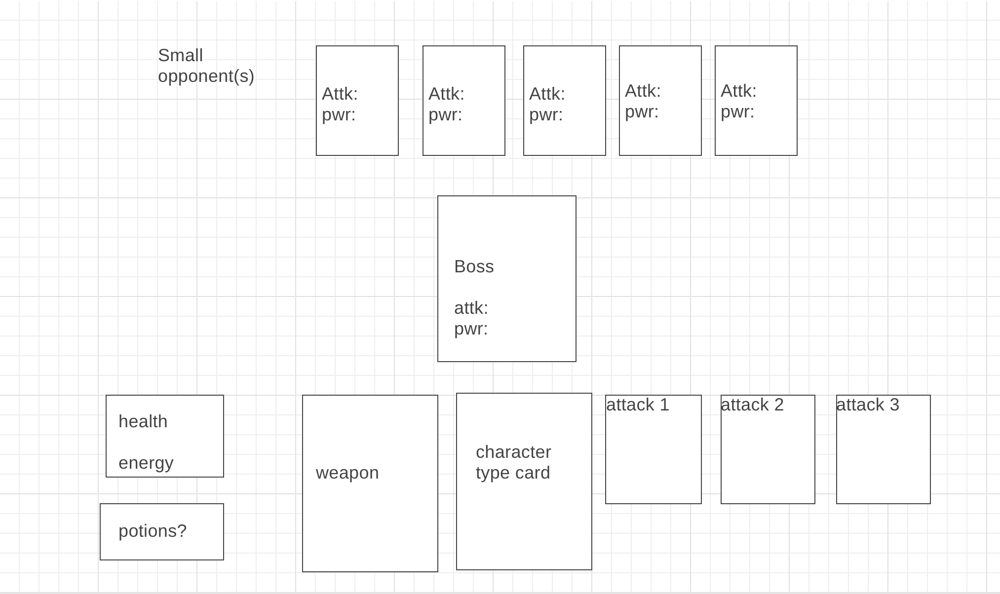
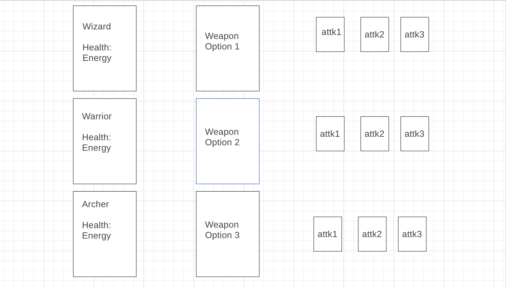

# Enchanting

Enchanting the Huddle - user stories.    

The user should be able to start a new game.  
The user should be able to choose one character type.  
The user should not be able to choose more than one character type.  
The user, after choosing the type, should be able to pick a weapon --stretch.  
The user should be able to see their health.  
The user should be able to see their energy level.   
The user should be presented with an opponent.  
The user should be able to choose an attack with weapon.  
The user should know how much energy each attack uses.  
The user should not be able to use an attack if they don’t have enough energy.  
The user should be able to regain energy.  
The user should be able to see the damage done to an enemy.  
The user should know when they are hit.  
The user should know how much they are hit for.  
The user should know if they have defeated an enemy.  
The user should know if they have been defeated (lost game) and not continue the game, or chose to restart the game.  
The user should know if they have beat all the opponents (win game) and not continue playing.  
The user has an option to quit.  

